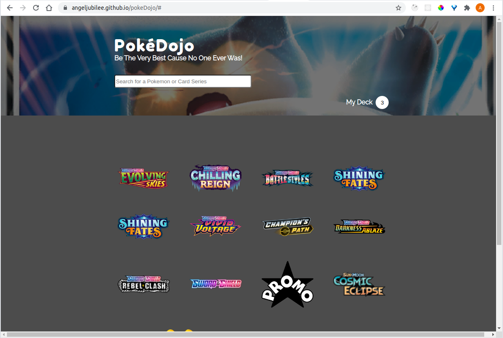
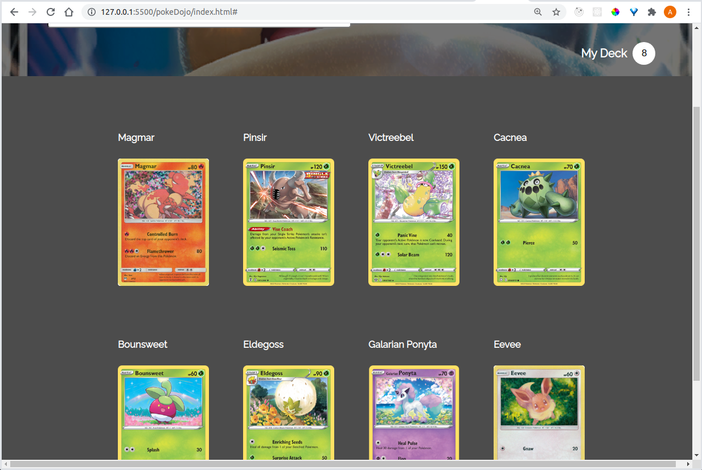

# pokemon-card-collector

A dynamic HTML, CSS, and JavaScript solo project.

## About

A Web application for people who want to look up Pokemon cards.

## Motivation

I wanted to build a website that connects to a public API.  I chose Pokemon TCG
because I like Pokemon and I enjoy the fun, colorful images on the cards.  Users
can use the website to see every Pokemon card ever released starting with the
latest pack.  The website also provides links on where to purchase a particular
card.

## Technologies used

- HTML
- CSS
- JavaScript
- XHR
- GitHub Pages

## Live Demo

Try the application live at [https://angeljubilee.github.io/pokemon-card-collector](https://angeljubilee.github.io/pokemon-card-collector).

## Features

- Users can see every series of Pokemon card packs ever released.
- Users can click on a series logo and view all pokemon cards in that series.
- Users can click on a card and add it to My Deck.
- Users can click on My Deck and see all cards that have been added.
- Users can click on a link to buy the card.
- Users can delete a card from My Deck.

## Stretch features

- Users can play paper rock scissors with their card deck.

## Preview




## Development

### System Requirements

Up to date browser

### Getting Started

1.  Clone the repository.
    ```shell
    git clone git@github.com:angeljubilee/pokemon-card-collector.git
    cd pokemon-card-collector
    ```

2.  Open index.html in your browser.
